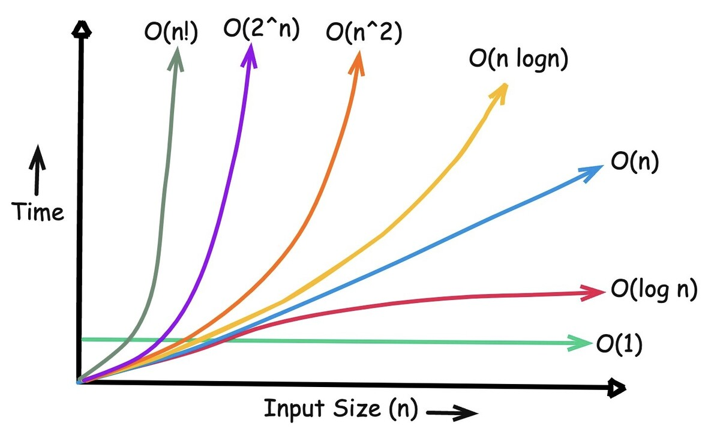

# Сложност на алгоритми - 03.10.2025

Асимптотичната сложност е начин за измерване
на ресурсите, които заемат алгоритмите, които пишем.
Има няколко различни нотации, чрез които се изразява,
но в този курс ще се ограничим до само една от тях - 
$\mathcal{O}(f(n))$ (чете се "О-голямо от $f(n)$"),
където $f(n)$ е някаква функция на променливата $n$,
например $n$, $\log{n}$, $1$ и др.

$\mathcal{O(f(n))} = \{ g(n) \; \vert \; \exists \, c > 0 \; \exists \, n_0 \in \mathbb{N} \, \forall n \geq n_o \, \colon 0 < g(n) \leq c.f(n) \}$

Идеята да се използва функция на някаква *естествена*
променлива $n$, е, че асимптотичната сложност на някаква функция зависи от големината на входа,
който бележим с $n$.

Разглеждаме два вида асимптотична сложност:

- по време - т.е. колко бързо се изпълняват определени
  алгоритми на база големината на входа;

- по памет - т.е. колко памет **допълнително** използва даден алгоритъм
  на база големината на входа.

Сложността на даден алгоритъм може да се разглежда в три случая:

- най-добър случай;
- среден случай;
- най-лош случай.

Умножението по или прибавянето на някаква константа към някаква функция
не влияят на асимптотичната сложност. Тоест, $2n + 10 = \mathcal{O}(n)$
(т.е. функцията има сложност $\mathcal{O}(n)$), $\frac{1}{2}n^2 = \mathcal{O}(n)$
и т.н.

Когато имаме функция, която е сбор на няколко други функции, то нейната сложност
съвпада със сложността на най-бързо растящото събираемо. Например:

- $n^4 + n^3 + n^2 = \mathcal{O}(n^4)$
- $n\log_2{n} + n{\log_2}^2{n} = \mathcal{O}(n\log_2{n})$
- $2^n + \prod_{i=1}^{n}i = 2^n + n! = \mathcal{O}(n!)$

---

